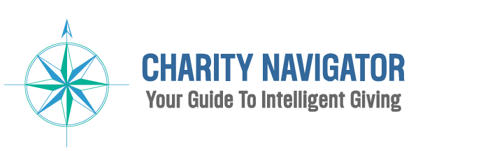

# Charity Project

by Samir Sundar, Jade Guo, Jennie Chang, Sanaz Shahbazian, Jack Oremus

## Project Overview

  

  

Our goal: Build a website to improve charity transparency through visualizations. We want donors to make informed decisions before choosing a charity worth their dollars.
- Composed of four pages
  * Main Page
  * Charity Navigation Table 
  * Charity Financial Information
  * National Chartiy Distribution and Variety of Ratings

## EXTRACT
Data Sources found on Kaggle:
- Charity Navigator Scores Expenses Dataset by Katy Qian
  
Dataset was in CSV format. Webscraped in 2019 with rating details from 2017. API had numerous nested objects/issues.

## TRANSFORM - What data cleaning/transformation was required?
- Cleaning
   - Excluded charities without ratings.
   - Renamed columns involving expenses, percentages, and ambiguous "scores".
   >  Includes: "tot_exp", "admin_exp_p", "fund_exp_p", "program_exp_p", "leader_comp", "leader_compensation_percentage",                       "program_exp", "fund_exp","admin_exp", "ascore","fscore", "tot_rev", "leader"
   - Dropped "description" column to cut down file size by over 50%.
   - Note that the csv was composed of objects and float64 dtypes.
   - No joining required because of single csv.
  
  

  

   

## LOAD
 - Load the final table to Mongo Atlas DB - ready for connection to our Flask app.py.
 
